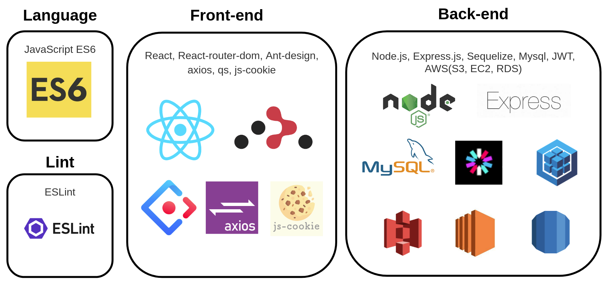

## 1. Intro

------

- **팀 명:** 태슬라(Teslra)
- **프로젝트 명:** 3ideas
- **프로젝트 형태:** 수강생 프로젝트
- **팀원:** 윤슬기**(팀장)**, 태라미, 민태관
- **배포 링크:** http://3ideas-client.s3-website.ap-northeast-2.amazonaws.com/

## 2. Project

------

## 3 ideas

3 ideas는 질문을 올리고 답변을 받을 수 있는 간단한 소셜 Q&A 서비스입니다.

3 ideas는 코딩 교육기관 코드 스테이츠의 웹 개발 심화 코스, 이머시브 코스의 first project 결과물입니다.

## Features

1. 사용자들은 질문을 올리고, 답변을 달 수 있습니다. → 궁금한 점을 해결하고, 내가 아는 지식을 나눌 수 있습니다.
2. 사용자들은 마음에 드는 답변을 추천할 수 있습니다. → 추천수는 질문자가 답변 선택 시 고려할 수 있는 하나의 척도가 됩니다.
3. 질문자는 받은 답변 중 베스트 3 답변을 선택합니다. → 베스트 1개를 선택할 때 보다, 조금 아쉽지만 마음에 드는 답변도 선택하여 표시할 수 있습니다.
4. 답변 선택이 마감된 질문을 확인하면 베스트 3 답변만 우선적으로 표시됩니다. → 글의 핵심 정보를 간결하게 훑어볼 수 있습니다.
5. 베스트 3 답변 외에도 추천수가 많은 순서대로 답변을 확인할 수 있습니다. → 추천수가 많은 답변과 작성자가 선택한 답변의 차이를 비교하면 여러 입장에서 정보를 들여다 볼 수 있습니다.

## Stack

### Front-end

JavaScript, React, React-router-dom, Ant-design, axios, qs, js-cookie

### Back-end

JavaScript, Node.js, Express.js, Sequelize, Mysql, JWT, AWS(S3, EC2, RDS)

## Visuals

1. 로그인과 회원가입 실패 시 실패 이유에 따라 메시지가 나타납니다.

2. 카테고리를 선택하여 질문글을 작성할 수 있습니다.

3. 질문에 대해 떠오른 아이디어를 답글로 작성할 수 있습니다.

4. 질문 작성자는 마음에 드는 세 개의 답글을 선택할 수 있습니다.

5. 답글이 선택된 글에 들어가면, 선택된 답글만이 보여집니다. 그곳에서 '모든 답글 보기' 버튼을 누르면 선택되지 않은 답글을 포함하여 좋아요가 많은 순서대로 답글이 보여집니다.

6. 원하는 키워드를 검색창에 입력하면 키워드를 포함한 질문글 제목, 질문글 내용과 답글 내용이 검색됩니다. 검색 결과에는 마킹된 키워드와 키워드가 포함된 문장 일부가 표시됩니다.

[Server API](https://www.notion.so/bebe65bf5f57486f9896be1a8a0c4e5b?v=82aed47bade549378db1936fcaa369ed)

## 3. Members

------

### **윤슬기(팀장)**

- Blog: https://velog.io/@sgyoon
- GitHub: https://github.com/seulgiyoon
- Position: Front-end
- 구현한 기능:
  - 로그인, 질문글과 답글 CRUD 및 내용 검색 인터페이스 구현
  - 기능과 사용자 경험을 고려한 UI 디자인 설계 및 구현
  - 인증 유무와 현재 페이지에 따라 페이지 이동 흐름 및 화면에 나타날 Component를 다르게 설계하여 사용자 경험 향상
  - 키워드를 검색하면 검색된 내용에서 키워드가 포함된 문장을 일부 표시하고, 검색한 키워드를 강조하여 빠른 정보 확인이 가능하도록 함

------

### **태라미**

- Blog: https://ram-t.tistory.com
- GitHub: https://github.com/RamiTae
- Position: Back-end
- 구현한 기능:
  - JWT와 Token을 이용한 자동로그인을 구현하여 잦은 로그아웃으로 인한 불편함 최소화
  - 로그아웃 시 만료되지 않은 토큰을 처리하기 위해 Blacklist테이블에 토큰을 저장하여 로그아웃 기능 구현
  - ORM인 Sequelize의 OR과 LIKE기능을 사용해 등록된 질문글과 답변글을 검색하는 기능 구현
  - 클라이언트가 보낼 수 있는 다양한 입력값에 대한 테스트를 바탕으로 예외처리 및 에러를 검토하여 상황에 따른 response 및 state 전송. 그를 통해 예상치 못한 서버 에러 발생을 최소화함
  - AWS의 S3 버킷의 정적 웹 사이트 호스팅 기능을 활용하여 클라이언트를 배포하고, EC2 인스턴스를 생성을 통해 서버를 배포. RDS로 MySQL 데이터베이스 생성 후 EC2와 연결해 EC2의 용량부담을 줄임
  - 회원가입 / 로그인 / 로그아웃 / 회원 탈퇴 , 질문글 등록 / 수정 / 삭제 / 조회 / 답변 선 택, 답변글 추천 추천/ 취소, 질문글 등록 시 다수의 카테고리 선택 기능 구현

------

### 민태관

- Blog: https://medium.com/@alsxorhks
- GitHub: https://github.com/TaekwanMin
- Position: Full-stack
- 구현한 기능
  - 서버에 질문에 대한 답변글 CRUD를 구현한 후 클라이언트의 답변글 CRUD와 추천기능을 구현하여 SNS 형태의 서비스를 구축
  - 질문에 달린 답변글들을 추천순 또는 질문자의 top3 채택순에 따라 정렬할 수 있도록 구현, 사용자의 경험 향상
  - 카테고리별로 질문목록을 필터링하여 유저가 원하는 주제의 질문들을 확인할 수 있도록 구현
  - 질문 형식 지정, 필수 입력과 선택 입력을 구분하여 유저의 질문 정보 입력 누락시 누락된 요소를 유저에게 알려 원활히 질문을 등록하게끔 구현